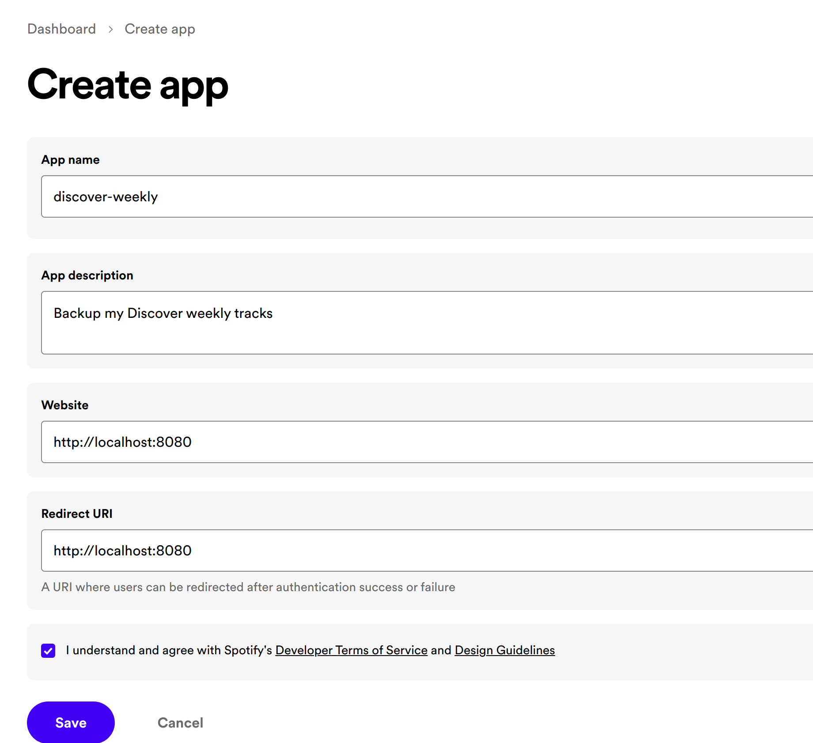
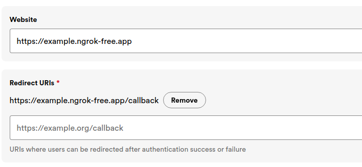

# Integrating with the Spotify API from Rust
The Spotify [Web API](https://developer.spotify.com) allows you, among other things, to:
- Retrieve data about an artist, album or track;
- Control and interact with playback(e.g. play, stop, seek etc.);
- Search music on spotify;
- Fetch and manage personal library(e.g., creating a new playlist; adding tracks to it, etc.).

Here we are going to implement a Rust web service that authenticates with the API and fetches the tracks on your Discover Weekly playlist.

## How Spotify API Auth works

- When the user wants to authorize access to their Spotify Account, they are taken to https://accounts.spotify.com/en/login where they will login and then authorize access to their account.
- The URL calls the Spotify Authorization API that returns an `authorisation_code` to the callback URL registered by the developer.
- In the callback URL, the developer will then make a POST call to the Spotify Token API to retrieve the `access_token` and `refresh_token`.
- The developer will then use the `access_token` to call the Spotify Web API to fetch data.

This flow is a classic OAuth 2.0 authorization flow, so if you are familiar with [OAuth 2.0](https://datatracker.ietf.org/doc/html/rfc6749) it should be quite familiar.
We are going to implement this authorization flow in Rust using the [Actix-Web](https://actix.rs/) crate.

## Bootstrap a new Actix-Web project
Actix-Web is one of the mature web development frameworks in the Rust ecosystem. To create a new Rust project run:
`cargo new discover-weekly`

Open the `discover-weekly` folder in your editor(e.g VS Code/CLion). Add the following dependency to your `Cargo.toml` file:

`actix-web = { version = "4"}
`

We are going to add a few more dependencies we will need for the rest of the project:

```rs
serde = { version = "1.0", features = ["derive"] }
env_logger = "0.10"
tokio = { version = "1.26", features = ["full"] }
awc = { version = "3.1.1", features = ["openssl"] }
serde_json = "1.0"
base64 = "0.21"
thiserror = "1.0"
async-std = "1.12"
async-trait = "0.1"
actix-http = "3.3.1"
openssl = "0.10"
redis = {version = "*", features = ["async-std-comp"]}
urlencoding = "*"
chrono = "*"
dotenv = "0.15.0"
```
I will explain as we go along when we use each of these dependencies.

## Create a new app on Spotify Developer Portal
1. Go to [developer.spotify.com](https://developer.spotify.com/dashboard). 
2. Login with your Spotify Account details. Go the dashboard and create a new app.



3. Once you create the app, you will get a dashboard you can see requests to your app and active users. Importantly, you will get a **Client ID** and **Client Secret**. You will also be able to manage the App Redirect URI, which will be our local backend on Actix-Web.



## Basic Callback Endpoint
1. Open `src/main.rs` and let us add the callback endpoint

```rs
struct AppState {
    config_provider: Box<dyn ConfigProvider>,
}

#[get("/callback")]
async fn callback(data: web::Data<AppState>, response: web::Query<AuthResponse>) -> impl Responder {

}
```


