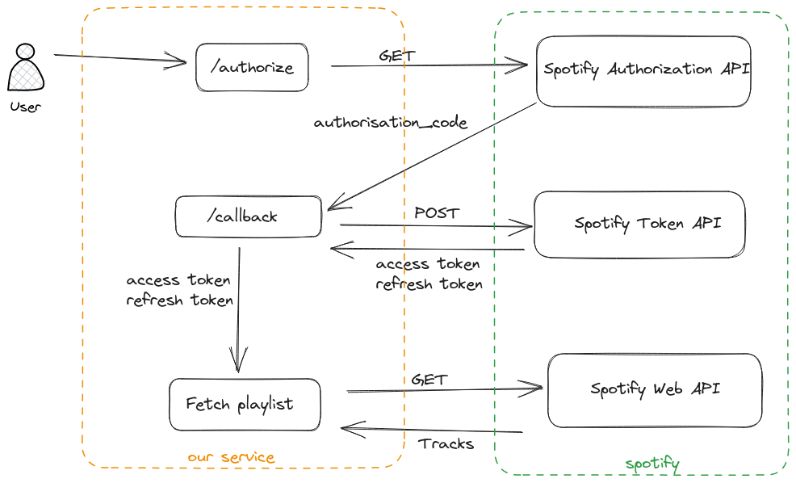

# Integrating with the Spotify API from Rust
The Spotify [Web API](https://developer.spotify.com) allows, among other things, you to:
- Retrieve data about an artist, album or track
- Control and interact with playback(e.g. play, stop, seek etc.)
- Search music on spotify.
- Fetch and manage personal library(e.g., creating a new playlist, adding tracks to it, etc.)

I had been hacking around with the API, and here we are going to implement a Rust web service that authenticates with the API and fetches the tracks on your Discover Weekly playlist.

## What we're going to build

